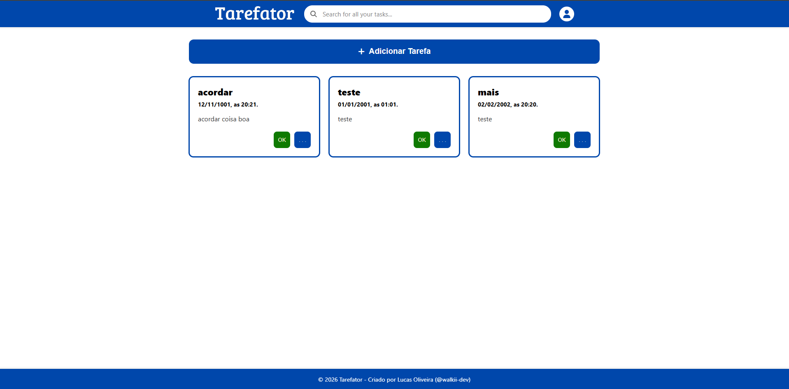
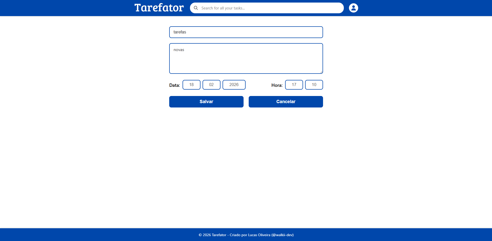
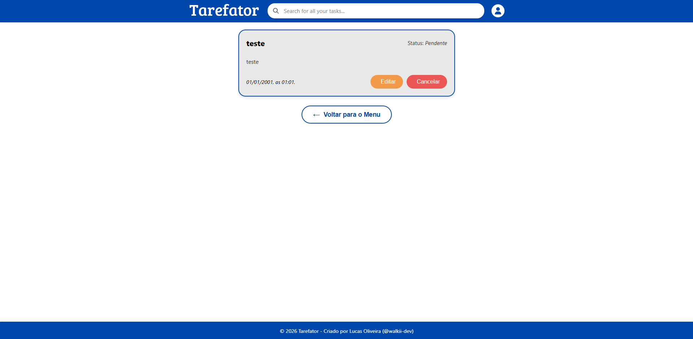

# 📃 Tarefator

Este é o frontend da aplicação Tarefator. ele foi feito pelo Angular. Este projeto ainda está `Em construção`!

## 📌 Requisitos para execução
- Node.js
- NPM
- Angular CLI
- TypeScript
- Json-Server

## 💻 Como Executar


Por agora, para executar o front desta aplicação você deve iniciar o banco de dados que está aplicado através do Json Server. Para isso, abra um terminal e digite o seguinte comando:
```bash
npm start
```
Para executar o front desta aplicação, abra um terminal novo terminal (de preferência abra um novo terminal em split ao anterior, para visualizar o front e o banco de dados rodando) e digite o seguinte termo:

```bash
ng serve
```
Uma mensagem pode aparecer que a aplicação está rodando, mas se quiser você pode ir no navegador e digitar
 `http://localhost:4200/`. O Angular gera o site com qualquer mudança feita em seus arquivos, então cuidado!

 ## 📂 Estrutura de Pastas
```text
frontend/
├── src/
│   ├── app/
│   │   ├── components/                 # Componentes reutilizáveis da aplicação
│   │   │    ├── page-footer/           # Cabeçalho da aplicação
│   │   │    ├── page-header/           # Rodapé da aplicação
│   │   │    └── task-operations/       # Operações relacionadas as tarefas
│   │   │         │
│   │   │         ├── create-tasks/     # Componente para criar tarefas
│   │   │         ├── edit-tasks/       # Componente de edição de tarefas
│   │   │         ├── task-card/        # Componente simples de tarefas
│   │   │         ├── task-card-detail/ # Componente detalhado de tarefa
│   │   │         └── tasks-list/       # Componente que lista as tarefas
│   │   │
│   │   ├── app.ts                      # Lógica do componente raiz
│   │   ├── app.html                    # organização principal da aplicação
│   │   ├── app.spec.ts                 # Testes unitários gerados automaticamente
│   │   └── app.config.ts               # Módulo principal (imports e declarations)
│   │
│   ├── assets/                         # Ícones da aplicação
│   ├── index.html                      # HTML base da aplicação
│   └── styles.scss                     # Estilos globais (feitos em CSS)
│
├── angular.json                        # Configuração do CLI e build
├── package.json                        # Dependências e scripts (npm start, build)
├── tsconfig.json                       # Configurações do TypeScript
└── README.md
```

## 📷 Telas




